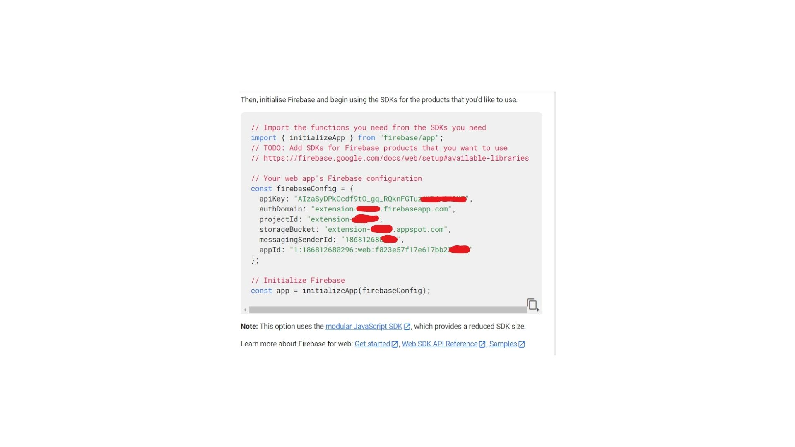
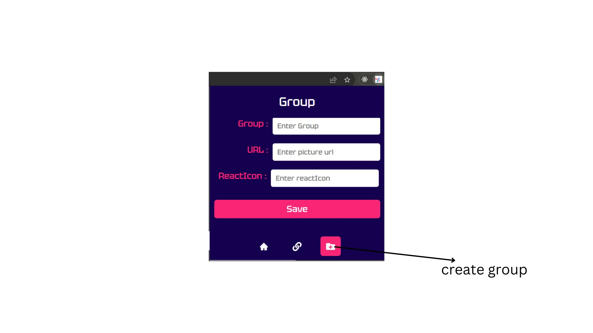

<h2>Initial setup for extention</h2>

    
To connect with firebase, you need to go first <a href="https://firebase.google.com/?gad=1&gclid=CjwKCAjwt52mBhB5EiwA05YKo5dG9nEYuA5mDJ7cz0-Ly4zFBNPIEjlju59KRxIkwUGQAtKJDcwp4xoC8pEQAvD_BwE&gclsrc=aw.ds" target="_blank">firebase console </a>. Create your project, which provide you SDKs for Firebase products like below

    

    
Now, go to the firebase.js  and change the firebaseConfig with your code.

        

<h1>Introduction about hezredirect</h1>

<h2>Group</h2>

    <h4>short brif</h4>
    
First of all, user need to create group from this section, which also provide to insert  icon(from react icon, only devicons,gameicons,font awesome 5 and simpleicons) or img URL 

<h2>Choose Group</h2>

    <h4>short brif</h4>
    
sellect the group to save title and link

<h2>Add Group</h2>

    <h4>short brif</h4>
    
This is the section where you add the important URL.Provide a suitable name of your link in title and add link in Url, Hit enter. There you go.

<h2>Home Section</h2>

    <h4>short brif</h4>
    
Home section is the landing page of our extention,there you see list of accordion.

